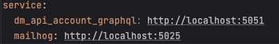
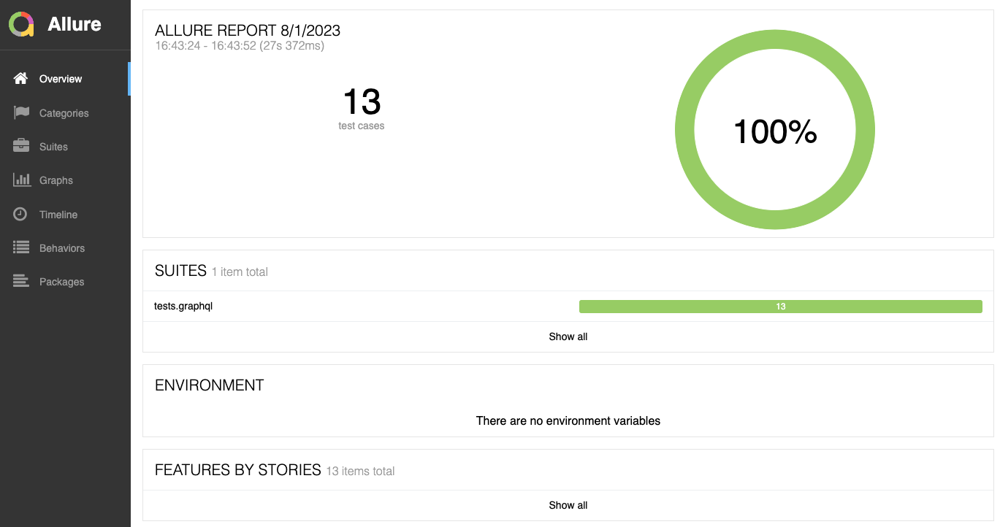
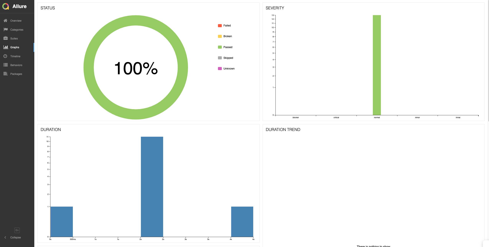
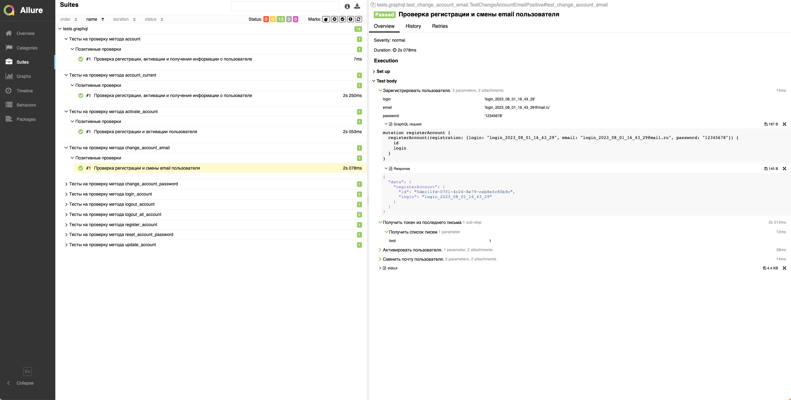

# Проект для тестирования GraphQL API сервиса DM API Account


### Ответственные лица:

* Меньшиков Валерий:
  * telegram: [Valeriy Menshikov](https://t.me/valeriy_menshikov)

  

### Тестируемый сервис:
**dm_api_account**
* API: [swagger](http://5.63.153.31:5051/graphql)


### Установка и запуск
```shell
 git clone https://github.com/ValeriyMenshikov/graphql_tests
 cd graphql_tests
 pip install -r requirements.txt
```

### Docker
```shell
docker build -t graphql_tests . 
docker run -it --rm graphql_tests
```
 

### Используемые технологии
<p  align="center">
  <code></code>
  <code></code>
  <code></code>
  <code></code>
  <code></code>
  <code></code>
  <code></code>
  <code></code>
</p>

### Архитектура проекта

```
 ├── configs                     # Папка со всей конфигурацией проекта
 │   ├── prod.yml                # Настройки для прода
 │   └── stg.yml                 # Настройки для тестовой среды
 ├── data                        # Папка для констант и статических тестовых данных
 │   └── post_v1_account.py      # Файл где должны храняться константы для метода создания аккаунта
 ├── modules                     # Папка с сырыми клиентами сервисов
 │   ├── grpc                    # gRPC клиенты
 │   ├── http                    # http клиенты
 │   └── db                      # db клиенты
 ├── common                      # Папка для констант и статических тестовых данных
 │   └── graphql_client          # Клиент с логгированием для работы REST API
 ├── generic                     # Папка с базовыми специфичными для проекта проверочными и вспомогательными классами и функциями
 │   ├── helpers                 # Папка для вспомогательного функционала общего назначения 
 │   │   └── account.py          # Помощник для работы с account_api
 │   ├── checkers                # Папка с чекерами
 │   │   └── сheckers.py         # Содержить общие чекеры
 ├── tests                       # Папка для хранения тестов
 │   └── ...                     # Тесты
 ├── .gitignore                  # Стандартный файл для игнорирования нежелательных файлов для загрузки в репозиторий
 ├── conftest.py                 # Файл с инициализацией настроек и фикстур
 ├── Dockerfike                  # Файл для сборки и запуска тестов
 ├── requirements.txt            # Файл с зависимостями
 └── README.md                   # Файл с описанием репозитория для тестов
```
### В файле config настраиваются окружения и выносятся основные подключения.



###  Allure report
##### После прохождения тестов, результаты можно посмотреть в генерируемом Allure отчете.


##### Во вкладке Graphs можно посмотреть графики о прохождении тестов, по их приоритезации, по времени прохождения и др.


##### Во вкладке Suites находятся собранные тест кейсы, у которых описаны шаги и добавлены логи.



